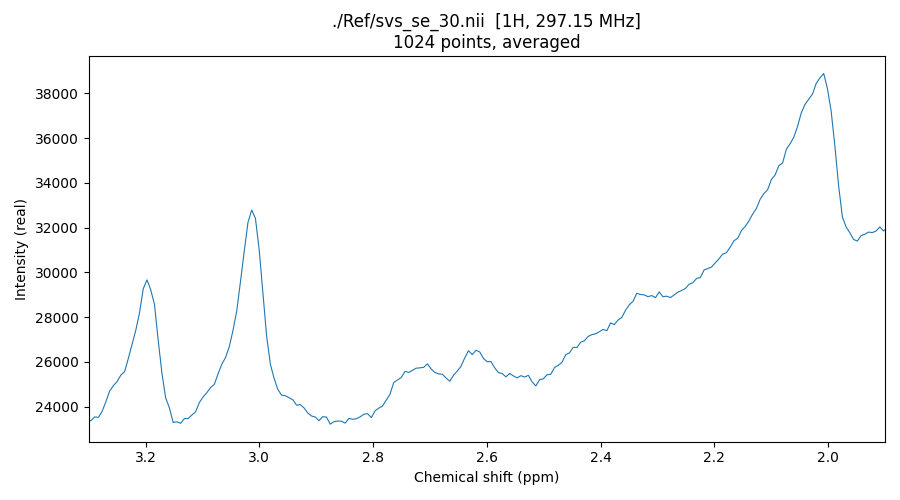

## About

This repository provides example DICOM Magnetic Resonance Spectroscopy data to illustrate conversion to the [BIDS standard](https://bids-specification.readthedocs.io/en/stable/modality-specific-files/magnetic-resonance-spectroscopy.html). At the moment, only Siemens XA60 DICOMs with single-voxel spectroscopy (svs) are provided.

## Running

Run `batch.sh`. It converts `In/` → `Out/` and diffs against `Ref/`.
Requires dcm2niix v1.0.20260605 or later.

## Visualization

A minimal Python script (`spec2graph.py`) is also provided to visualize these samples. It requires `numpy`, `nibabel`, and `matplotlib`:

```bash
pip install numpy nibabel matplotlib
```

Here are some examples of usage:

```bash
# overlay all 64 transients
python spec2graph.py ./Ref/svs_se_30.nii
# average the transients
python spec2graph.py ./Ref/svs_se_30.nii --average
# zoom to 2–3 ppm, @3T: NAA ~2.02 ppm Cr ~3.03 Cho ~3.22
python spec2graph.py ./Ref/svs_se_30.nii -a --ppm-range 1.9 3.3
# x-axis in Hz
python spec2graph.py ./Ref/svs_se_30.nii -a --hz
# magnitude (also real/imag/phase)
python spec2graph.py ./Ref/svs_se_30.nii -a -m magnitude
# save instead of display
python spec2graph.py ./Ref/svs_se_30.nii -o spec.png
```



## Links

 - BIDS [Magnetic Resonance Spectroscopy](https://bids-specification.readthedocs.io/en/stable/modality-specific-files/magnetic-resonance-spectroscopy.html) specification
 - [spec2nii](https://github.com/wtclarke/spec2nii) handles a broader range of MR spectroscopy than dcm2niix, and can also process this example dataset.
